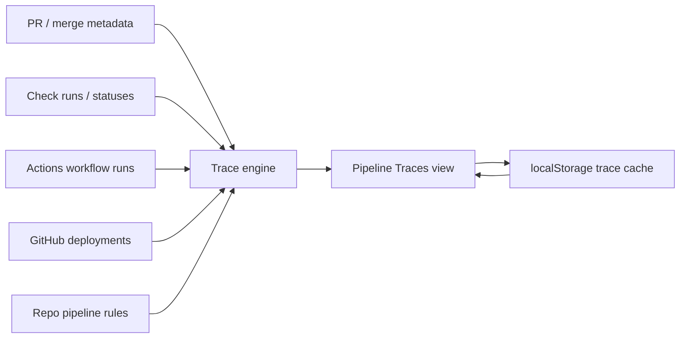

# PR Production Tracing Design

## Objective

Flag every pull request whose journey does not complete from merge intent through successful production CD. The dashboard should answer: "Which PRs are still somewhere in the delivery pipeline, which made it to production, and which fell out of the journey?"

This design extends GitHub Monitor's current local-first model. It should keep the app dependency-light, avoid storing tokens, and use GitHub as the source of truth while adding enough local trace state to detect incomplete journeys across refreshes.

## Product Framing

Primary user: maintainers and release owners watching many repositories at once.

Job to be done: When a PR is merged or ready to ship, I want to track it through CI, merge, CD, deployment, and production verification, so that no change silently misses production.

Success metrics:

- Time to notice a PR stuck after merge: target under 5 minutes while auto-refresh is active.
- False "not shipped" flags: target under 10% after repository pipeline rules are configured.
- Unknown pipeline mappings: target under 20% of active repos after first setup pass.
- User action completion: every flagged journey exposes a next action link to PR, run, deployment, or configuration.

Non-goals:

- Hosted team alerting or long-term analytics.
- Replacing GitHub environments, Actions, deployment protection rules, or observability platforms.
- Proving runtime correctness after deploy. This feature tracks delivery completion, then offers production review links where available.

## Definitions

Pipeline journey: a trace record for one deployable change unit. The default unit is a merged PR. For squash/rebase merges, the trace follows the merge commit SHA, PR head SHA, and associated workflow runs.

Production completion: the journey reaches an accepted terminal production event. Accepted evidence, in priority order:

1. GitHub deployment status with `environment` matching a production rule and final state `success`.
2. CD workflow run matching a production workflow rule with conclusion `success`, not `skipped`.
3. Repository-specific completion rule configured by the user.

Incomplete journey: any non-terminal journey that exceeds its stage SLA, reaches a failed/cancelled/skipped terminal event, or cannot be mapped to a required next stage.

## Current-State Fit

The app already has most read-side ingredients:

- `server.js` scans open PRs through GraphQL and groups by CI state.
- `server.js` scans CD/deploy/release/publish workflows and GitHub deployments when CD audit is enabled.
- `server.js` infers production URLs and renders visual production review cues for finished CD runs.
- `public/app.js` already has separate views for failing CI, running CI, passing PRs, running CD, finished CD, failed CD, and deployments.
- Browser `localStorage` already stores dashboard preferences and notification inbox history.

The missing capability is correlation and memory: today, CD runs and PRs are adjacent lists rather than a durable journey from PR to production.

## Recommended Architecture

Use a lightweight trace engine in the local Node server plus browser-local persisted journey snapshots. The server calculates the current truth from GitHub on every `/api/status` scan. The browser persists recent journey records in `localStorage` so a merged PR can continue to be tracked after it disappears from the open-PR query.



### Why this approach

This fits the current local-first product. It avoids a server database, keeps credentials ephemeral, and still lets the app remember merged PRs long enough to detect missing production completion. The trade-off is that trace history is per-browser and bounded; that is acceptable for this product's stated local utility scope.

## Alternatives Considered

### Option A: Live-only correlation

Correlate only open PRs, current workflow runs, and recent deployments in each scan.

Pros: simplest implementation, no storage changes.  
Cons: merged PRs disappear too quickly; missed production completion cannot be detected reliably.  
Decision: reject.

### Option B: Browser-local trace cache

Persist recent traces in browser `localStorage`; server returns fresh evidence and classifications.

Pros: fits product constraints, no database, fast to ship, no token persistence.  
Cons: state is tied to one browser; clearing storage loses history.  
Decision: recommended for v1.

### Option C: Local server-side SQLite

Persist traces in a local SQLite database.

Pros: stronger history, better querying, survives browser reset.  
Cons: changes the app's "no database" promise and adds operational questions.  
Decision: reserve for a later "local history" mode if users need durable audit trails.

## Data Model

Add these response shapes to `/api/status`:

```js
{
  summary: {
    incompleteJourneys: 3,
    blockedJourneys: 1,
    shippedJourneys: 12,
    tracingUnknown: 2
  },
  traces: {
    active: [],
    flagged: [],
    completed: [],
    unknown: [],
    rules: []
  }
}
```

Trace record:

```js
{
  id: "owner/repo#123",
  repo: "owner/repo",
  prNumber: 123,
  title: "Add billing export",
  author: "octocat",
  prUrl: "https://github.com/owner/repo/pull/123",
  headSha: "abc123",
  mergeCommitSha: "def456",
  baseRef: "main",
  stage: "cd_running",
  status: "active",
  severity: "medium",
  startedAt: "2026-06-01T12:00:00.000Z",
  lastEvidenceAt: "2026-06-01T12:04:00.000Z",
  deadlineAt: "2026-06-01T12:20:00.000Z",
  reason: "Merged PR has no successful production CD run yet.",
  nextAction: {
    label: "Open deploy run",
    url: "https://github.com/owner/repo/actions/runs/1"
  },
  stages: [
    { key: "pr_opened", label: "PR opened", status: "complete", at: "..." },
    { key: "ci_complete", label: "CI complete", status: "complete", at: "..." },
    { key: "merged", label: "Merged", status: "complete", at: "..." },
    { key: "cd_started", label: "CD started", status: "complete", at: "..." },
    { key: "prod_complete", label: "Production complete", status: "missing" }
  ],
  evidence: [
    { type: "pull_request", label: "PR #123 merged", url: "...", at: "..." },
    { type: "workflow_run", label: "Deploy #456 in progress", url: "...", at: "..." }
  ],
  rule: {
    source: "auto",
    productionEnvironmentPattern: "prod|production",
    cdWorkflowPattern: "cd|deploy|deployment|release|publish",
    maxStageAgeMinutes: 30
  }
}
```

## Trace Classification

Use a finite state machine with explicit terminal states:

| Stage | Complete Evidence | Flag Condition |
| --- | --- | --- |
| `pr_opened` | PR exists or appears in local trace cache | None |
| `ci_complete` | all required checks are complete and passing | failing, cancelled, timed out, or running past SLA |
| `merged` | PR has `merged_at` or merge commit evidence | PR closed unmerged, mergeability blocked past SLA |
| `cd_started` | matching CD run/deployment starts after merge SHA/head SHA | no matching CD start past SLA |
| `prod_complete` | production deployment success or successful non-skipped CD run | failed, cancelled, skipped, timed out, or no success past SLA |

Status values:

- `active`: journey is moving and has not exceeded SLA.
- `flagged`: journey is blocked, failed, skipped, stale, or missing required evidence.
- `completed`: journey reached production completion.
- `unknown`: repo lacks enough rules to tell whether production completion is required.

Severity:

- `critical`: production CD failed, cancelled, timed out, or a configured production deployment failed.
- `high`: PR merged but no CD started inside SLA.
- `medium`: CD is still running or queued beyond SLA.
- `low`: repo needs mapping/configuration before tracking can be trusted.

## Correlation Rules

Start with automatic correlation and allow repository overrides later.

Default automatic mapping:

- PR to CI: existing status rollup contexts on the latest PR commit.
- PR to merge: fetch recently merged PRs per repo and retain their `head.sha`, `merge_commit_sha`, `merged_at`, `base.ref`, and files.
- Merge to CD: match workflow runs where `head_sha` equals PR head SHA or merge commit SHA, or where run branch equals base ref and run creation is after `merged_at`.
- CD to production: prefer successful GitHub deployment statuses where environment matches `/prod|production/i`; otherwise accept successful CD workflow runs matching the current CD workflow pattern.

Repository override file, optional future enhancement:

```json
{
  "version": 1,
  "repos": {
    "owner/repo": {
      "productionEnvironments": ["production"],
      "cdWorkflows": ["Deploy Production"],
      "requiredStages": ["ci_complete", "merged", "cd_started", "prod_complete"],
      "slaMinutes": {
        "ci_complete": 30,
        "cd_started": 15,
        "prod_complete": 45
      }
    }
  }
}
```

Config location options:

- Browser settings for local-only use.
- `.github-monitor.json` in the monitored repo for team-shared conventions.
- Environment variable pointing to a local JSON config for private overrides.

For v1, use automatic rules and expose "Unknown mapping" instead of requiring config.

## API Changes

Extend `GET /api/status` with one optional query parameter:

```text
includeTraces=1
```

When enabled, server work should:

1. Build current open PR groups as today.
2. Fetch recent merged PR metadata for every repo in scope, not only for finished CD summaries.
3. Fetch recent CD runs and deployments as today.
4. Build trace evidence records.
5. Classify traces using rules and stage SLAs.
6. Return `traces` and `summary` counts.

Keep the existing CD audit toggle as the controlling expensive scan. If `includeCd=0`, trace data should degrade gracefully and return unknown or open-CI-only journeys.

## UI/UX Design

Add one first-class dashboard view: `Pipeline Traces`.

Scoreboard additions:

- `Flagged` count: red when non-zero.
- `In Flight` count: amber/blue.
- `Shipped` count: green for recent completions.
- `Unknown` count: gray, for repos needing mapping.

Rail additions:

- `Pipeline Traces` placed before `Running CD`.
- Optional subfilter chips inside the panel: `Flagged`, `In flight`, `Completed`, `Unknown`.

Row/card behavior:

- Each trace appears as a compact journey card with a stage timeline.
- The first line names the repo and PR.
- The second line explains the exact flag reason in plain language.
- Stage pills use consistent statuses: complete, active, blocked, missing, unknown.
- Primary action links to the most useful evidence: failed run, running run, deployment, PR, or configuration.
- Completed journeys are collapsed by default and retained for 24 hours.

Suggested card copy:

- `Production missing`: "Merged 18m ago, but no production CD run has completed."
- `CD failed`: "Deploy Production #421 failed after this PR merged."
- `Deploy skipped`: "CD was skipped; production was not updated."
- `Mapping unknown`: "No production workflow or deployment environment was detected for this repo."

Accessibility and responsive requirements:

- Timeline stages must be text-labeled, not color-only.
- Flag reason should be announced in the card heading or `aria-describedby`.
- Cards must stay readable at 320px width; timeline wraps into two rows.
- Keyboard users can tab to PR, run, deployment, and config links in a predictable order.
- Counts and new flags update in the existing `aria-live` content area without stealing focus.

## Browser Persistence

Add a new localStorage key:

```js
const TRACE_CACHE_KEY = "pr-deck:traces:v1";
```

Persist only non-sensitive metadata:

- trace id, repo, PR number, title, URLs, stage statuses, timestamps, and evidence URLs.
- no tokens, no response headers, no private file content.

Retention:

- active and flagged traces: 7 days.
- completed traces: 24 hours.
- unknown traces: 7 days or until mapping is resolved.
- hard cap: 250 traces.

Merge strategy:

- Server returns fresh trace evidence.
- Browser cache preserves journeys that disappeared from the latest scan but are still inside retention.
- Fresh server terminal states override cached non-terminal states.
- Cached flagged traces remain visible until completed, expired, or manually dismissed.

## Notifications

Reuse the existing notification inbox. Add events:

- `journey_flagged`: first time a trace enters flagged state.
- `journey_completed`: flagged or active trace reaches production completion.
- `journey_unknown`: repo cannot be mapped after a merged PR is detected.

Avoid repeated noise:

- Notify once per trace per status transition.
- Do not notify every refresh for the same failure.
- Suppress completed notifications for traces that completed without ever being flagged unless the user enables them later.

## Implementation Roadmap

### Phase 1: Server trace model

- Add trace classification helpers and tests around state transitions.
- Fetch recent merged PRs as first-class trace inputs.
- Correlate merged PRs to CD runs and deployments.
- Add `includeTraces=1` response shape.
- Add summary counts.

### Phase 2: Browser trace cache and notifications

- Add `TRACE_CACHE_KEY` persistence with retention and caps.
- Merge server traces into cached traces.
- Trigger inbox/browser notifications on status transitions.
- Add tests for cache merge and pruning logic where practical.

### Phase 3: Trace UI

- Add metrics, rail item, and `pipelineTraces` view.
- Render compact journey cards with stage timeline and action links.
- Add filter chips for status subsets.
- Add empty, loading, unknown, and long-content states.

### Phase 4: Rule tuning

- Add optional repo-level local config.
- Surface "mapping unknown" with a suggested rule.
- Support production environment/workflow overrides.
- Add a small rule debug panel per unknown trace.

## Acceptance Criteria

- A merged PR with a successful production deployment is shown as completed and is not flagged.
- A merged PR whose CD workflow fails is flagged with severity `critical` and links to the failed run.
- A merged PR whose CD workflow is skipped is flagged with copy that production was not updated.
- A merged PR with no matching CD start after the configured SLA is flagged with severity `high`.
- A PR still waiting on CI is active until SLA breach, then flagged.
- A repo with no detectable production workflow or environment is shown as unknown, not falsely passed.
- Trace cards remain available after the PR disappears from the open PR search.
- The app stores no credentials and does not add a server-side database.
- Existing CD audit, auto-refresh, quota handling, and notification inbox behavior continue to work.

## Test Plan

Unit tests:

- classification state machine.
- CD run outcome handling: success, failure, cancelled, timed out, skipped.
- deployment environment matching.
- PR-to-CD correlation with merge SHA, head SHA, and base branch fallback.
- trace cache merge and retention.

Integration tests:

- `/api/status?includeCd=1&includeTraces=1` returns traces and counts for mocked GitHub API data.
- Rate-limit warnings still appear and trace scanning degrades gracefully.
- Existing CD finished/failed behavior remains unchanged.

UI checks:

- Desktop and mobile render of flagged, active, completed, and unknown cards.
- Keyboard traversal through trace cards.
- Screen-reader labels for timeline stages and status reasons.

## Risks

High: GitHub data can be ambiguous for squash/rebase merges, reusable workflows, multi-environment pipelines, or CD triggered by external systems. Mitigation: show unknown/mapping-needed instead of assuming success.

High: API cost can rise when scanning merged PRs, runs, deployments, and files across many repos. Mitigation: keep `includeTraces` behind CD audit, use existing caches, cap recent merged PRs, and slow refresh under quota pressure.

Medium: Browser-local trace state can diverge across machines. Mitigation: label this as local monitoring and keep future SQLite/team modes separate.

Medium: False positives may train users to ignore flags. Mitigation: provide repo rule overrides and make every flag explain the exact missing evidence.

## Open Questions

- Should "ready to merge but not merged" be part of the production journey, or should journeys start only after merge?
- What is the default SLA per stage: 15, 30, or 60 minutes?
- Should successful production completion require GitHub Deployment evidence when available, or is a successful deploy workflow enough?
- Should manually dismissed flagged traces stay dismissed if the same evidence remains on the next refresh?
